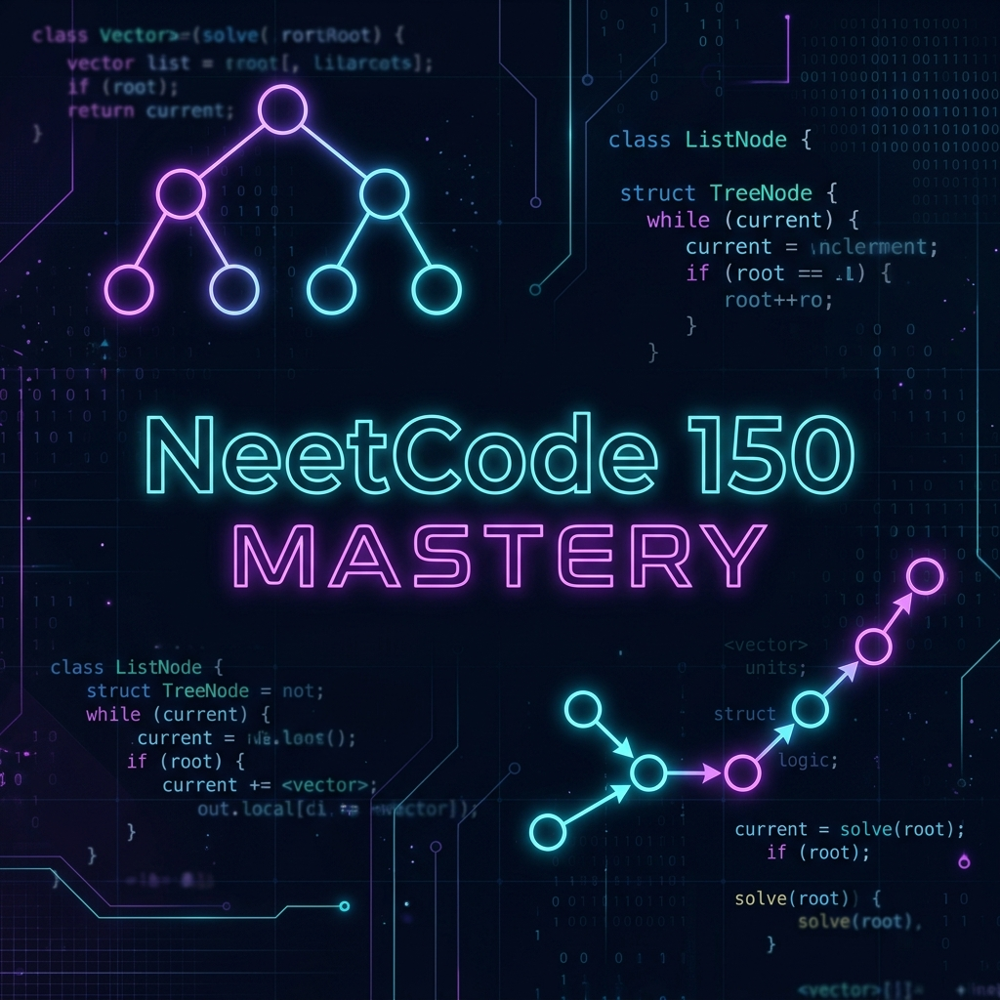

# 🚀 NeetCode 150 Mastery Journey

  
  
  

---

### 📑 Overview
This repository is an organized collection of my solutions for the **NeetCode 150** curriculum. It represents my dedication to perfecting algorithms, data structures, and problem-solving patterns required for competitive programming and technical interviews at top-tier tech companies.

> **"Mastery is a marathon, not a sprint. Every problem solved is a piece of the puzzle."**

---

### 📊 Progress Roadmap

| Problem # | Title | Pattern | Difficulty | Solution | Progress |
|:---:|:---|:---:|:---:|:---:|:---:|
| 1 | **Contains Duplicate** | Arrays & Hashing | 🟢 Easy | [View](./problem1.md) | ✅ Done |
| 2 | **Valid Anagram** | Arrays & Hashing | 🟢 Easy | [View](./problem2.md) | ✅ Done |
| 3 | **Two Sum** | Arrays & Hashing | 🟢 Easy | [View](./problem3.md) | ✅ Done |
| 4 | **Group Anagrams** | Arrays & Hashing | 🟡 Medium | [View](./problem4.md) | ✅ Done |
| 5 | **Top K Frequent Elements** | Arrays & Hashing | 🟡 Medium | [View](./problem5.md) | ✅ Done |
| 6 | **Product of Array Except Self** | Arrays & Hashing | 🟡 Medium | [View](./problem6.md) | ✅ Done |

---

### 💻 Local Environment
- **Author:** [Vignesh1116](https://github.com/Vignesh1116)
- **Language:** Python 3.x
- **Editor:** Visual Studio Code / Neovim

---

### 🛠️ Navigation
- [x] Arrays & Hashing (Complete Phase 1)
- [ ] Two Pointers
- [ ] Sliding Window
- [ ] Stack
- [ ] Binary Search

---
*Maintained with excellence by **Vignesh1116**.*
